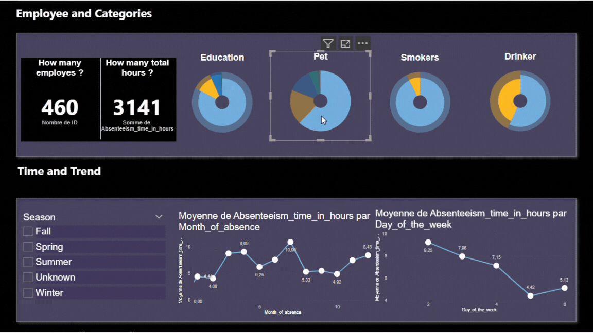

# **HR Absenteeism and Health Dashboard**



# Introduction

This project was carried out to analyse data relating to absenteeism and employee health and to meet the needs of human resources (HR). The main objective is to provide a data-driven solution for :
 - Identify healthy employees with low absenteeism for a bonus programme.
 - Calculate a salary increase for non-smokers within a defined budget.
 - Design an interactive dashboard to help HR understand absenteeism trends.

## Dashboard File
My final dashboard is in .

## Tools I Used

- **SQL :** Used to prepare and enrich data. Joins are used to centralise information from several tables (absenteeism, compensation, reasons for absence). Additional calculations such as BMI categories (underweight, normal weight, etc.) and seasons were integrated to enrich the analysis.
- **Power BI:** 
    - Curve graphs to visualise monthly and seasonal absence trends.
    - Ring charts to represent the distribution of reasons for absence and other categories.
    - Segments (slicers) to enable interactive filters that include seasons

## Data used

The following files were used as sources :
- : Employee absence data.
- : Information on employee salaries and benefits.
- : List of possible reasons for absences.

# 1. Healthy employees with low absenteeism for a bonus programm

To answer this question we carried out the following steps: 

- Merging data files :

```sql
SELECT *
FROM Absenteeism_at_work AS a
LEFT JOIN compensation AS b ON a.ID = b.ID
LEFT JOIN Reasons AS r ON a.Reason_for_absence = r.Number;
```
- Identifying healthy employees :

```sql
SELECT *
FROM Absenteeism_at_work
WHERE Social_drinker = 0 
      AND Social_smoker = 0 
      AND Body_mass_index < 25 
      AND Absenteeism_time_in_hours < (SELECT AVG(Absenteeism_time_in_hours) FROM Absenteeism_at_work);
```

# 2. Calculate a salary increase for non-smokers within a defined budget.

To do this, we calculate the number of non-smokers : 

```sql
SELECT COUNT(*) AS nonsmokers
FROM Absenteeism_at_work
WHERE Social_smoker = 0;
```
We obtain **686 non-smokers**. With a total budget of $983,221, this translates into **an increase of $0.68 per hour for each non-smoker**.
Here's the detailed calculation:
- An employee works an average of 2080 hours a year (8 hours × 5 days × 52 weeks).
- The total number of hours worked by the 686 non-smokers is 1,426,880 hours (686 × 2080).
- Dividing the total budget ($983,221) by the total number of hours worked (1,426,880 hours) gives an increase of $0.68/hour.
- Per employee, **this increase corresponds to $1,414.4 per year** (2,080 hours × $0.68).

# 3. An interactive dashboard to help HR understand absenteeism trends

To design an interactive dashboard to help HR understand absenteeism trends I've decided to include the following elements : 

```sql
SELECT a.ID,
       r.Reason,
	   Month_of_absence,
	   Body_mass_index,
	   CASE WHEN Body_mass_index < 18.5 THEN 'Underweight'
			WHEN Body_mass_index BETWEEN 18.5 AND 25 THEN 'Healthy'
			WHEN Body_mass_index BETWEEN 25 AND 30 THEN 'Overweight'
			WHEN Body_mass_index > 30 THEN 'Obsese'
			ELSE 'Unknown' END AS BMI_Category,
	   CASE WHEN Month_of_absence IN (12,1,2) THEN 'Winter'
	   WHEN Month_of_absence IN (3,4,5) THEN 'Spring'
	   WHEN Month_of_absence IN (6,7,8) THEN 'Summer'
	   WHEN Month_of_absence IN (9,10,11) THEN 'Fall'
	   ELSE 'Unknown' END AS Season_Names,
	   Month_of_absence,
	   Day_of_the_week,
	   Transportation_expense,
	   Education,
	   Son,
	   Social_drinker,
	   Social_smoker,
	   Pet,
	   Disciplinary_failure,
	   Age,
	   Work_load_Average_day,
	   Absenteeism_time_in_hours
FROM Absenteeism_at_work AS a

LEFT JOIN compensation AS b
ON a.ID = b.ID

LEFT JOIN Reasons AS r 
ON a.Reason_for_absence = r.Number;
```

The dashboard uses enhanced data to analyse employee absenteeism. The **reasons for absence**, extracted from the reasons table, make it possible to identify the main causes of absenteeism. Employees are also classified according to their **body mass index (BMI)** into four categories: underweight, normal weight, overweight and obese.

Absences are grouped by **season** (winter, spring, summer, autumn) according to the month of absence, which makes it possible to detect the periods of the year with the greatest impact.

**Demographic and social variables** include information such as **age, level of education**, as well as **family data**, such as the number of children and pets.

Performance and work-related data include **average daily workload, any disciplinary failures, and transport expenditure**.

Finally, data specific to absenteeism includes **the total time of absence in hours, the days of the week involved, and the months of absence**, making it easier to identify critical trends.

Here is the differents sections of the dashboard : 

- **Section 1 :** This section presents the main performance indicator,providing a quick overview of overall absenteeism.
- **Section 2 :** Here you can find more detailed information about employees and their working hours. For example, the total number of employees and the number of hours they work are displayed. This section also allows you to correlate this data with social and demographic variables such as employees' education, smoking status, etc. These correlations help to understand the factors influencing absenteeism.
- **Section 3 :** This section uses graphs to visualise absenteeism trends according to the different periods of the year. It allows you to detect peaks in absenteeism during certain seasons or months, making it easier to identify critical periods when absence management action may be required.
- **Section 4 :** In this section, graphs detail the main reasons for employee absenteeism. This makes it possible to identify the dominant causes (illness, accidents, etc.) and to analyse their impact on overall absenteeism.


# Conclusion

This dashboard provides a comprehensive and interactive overview of absenteeism within the organisation. By combining key KPIs, detailed employee metrics, analysis of seasonal trends and reasons for absence, it enables informed decision-making. The links between different variables, such as education, smoking status and time of year, provide an in-depth understanding of the factors influencing absenteeism. Thanks to its interactivity, the dashboard allows users to explore the data in a flexible way and identify opportunities for improvement in absence management. In short, it is a powerful tool for optimising human resources management and improving organisational productivity.